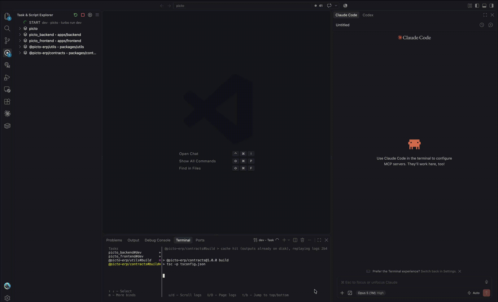

# Embedded Browser with Claude Code and Codex plugins integration

**A browser tab inside your editor that your AI agent can see, read and drive — and that turns
anything on the page into a prompt.**



Front-end work is a loop: look at the page, find the element, describe it to the assistant,
check what changed. This extension closes that loop without leaving the editor.

- 🌐 **A real browser in a tab.** Your dev server renders in an editor tab next to the code, with
  an address bar, history and the page's own favicon — not a screenshot, not a headless copy.
- 🎯 **Point at an element, get everything about it.** Click anything in the page and get a full
  report: what it is, where it sits in the html, its outer markup, its box, and the css rules
  that actually apply to it, read out of the page's own CSSOM.
- 📍 **Or just the address of the element.** A CSS selector or an XPath, built to survive a
  rebuild — framework-generated class names and ids are filtered out, and `data-testid` and
  friends win over structure.
- ✨ **One click turns it into a prompt.** Send the element, its selector or its path straight
  into Claude Code or Codex, as an attachment their agent reads — so "make this button match
  the one above" is a sentence, not a paragraph of description.
- 🐛 **Everything the page logged.** The console since load, uncaught errors included, to the
  clipboard or to the assistant — the fastest way to hand over a bug you can see.
- 🔌 **An MCP server comes up on its own.** No install, no separate process: the extension starts
  a local server and the connect commands configure Claude Code, Codex or VS Code's own chat
  for you.
- 🤖 **Then the agent works the page itself.** It can list what is on screen and what is
  clickable, read the html or the text, inspect one element, click, fill fields, wait for
  something to render, navigate — and read the console afterwards to see what it did.
- 👀 **On the page you are already looking at.** Same session, same cookies, same dev server, same
  logged-in state. The agent is not opening a fresh browser somewhere else; it sees exactly
  your screen, and you watch it work.
- 🔄 **Both directions, all the time.** Pick things by hand when you know what you want, or ask
  the agent to go find it. Nothing has to be re-described from one to the other.
- 🔒 **Local by construction.** The server listens on the loopback interface only, with a token
  per workspace, and the page is never told it. Dev servers on different ports no longer share
  each other's cookies.

It started as a standalone copy of the Simple Browser extension that ships with VS Code,
repackaged so it can be built and installed on its own.

## The sidebar

The icon in the activity bar opens a view with everything the extension can do, so none of it
has to be remembered as a command:

- **Browser** — the page the panel has open and whether it can be read, a field to open another
  one, and a reload.
- **This page** — pick an element or take the console output, to the clipboard or straight to
  whichever assistant is installed. The same entries as the panel's own copy menu.
- **MCP server** — whether it is running and on which port, the two connect commands, and
  **Check connection** (below).
- **Recent** — the pages this project's panel has been on, so one is a click away after the
  panel is closed.

Its title bar carries three buttons of its own: open a page, refresh the view, and this
extension's settings.

## Connecting an assistant

You need the official extension for the assistant you use — **Claude Code**
(`Anthropic.claude-code`) or **OpenAI Codex** (`openai.chatgpt`). Without it the copy menu
shows no entries for that assistant. The mcp server below is the exception: it is configuration
files that the assistant reads, so its cli alone is enough.

1. **Open a page** in the panel — **Tab Browser Ultimate: Show**, or `Cmd`/`Ctrl` + click a
   localhost url a dev server printed in the terminal.
2. **Run the connect command** — from the browser icon in the activity bar, or from the command
   palette: **Connect Claude Code to This Browser (MCP)** / **Connect Codex to This Browser
   (MCP)**.
3. **Pick how the server gets configured.** Any one of these does the job:
   - **Copy connection prompt** — paste it into the assistant and let it add the server and
     check it for you. It carries this window's token, so it goes to that assistant and nowhere
     else.
   - **Write .mcp.json** (Claude Code) / **Write .codex/config.toml** (Codex) — the entry stays
     with the project. The token is written into the file, so ignore it in git if the project
     is shared.
   - **Add to Codex globally** — `codex mcp add` writes `~/.codex/config.toml`, under a name
     ending in the project's, so a second project does not overwrite the first.
   - **Copy CLI command** — run it yourself, and the token stays out of the repository.
4. **Let the assistant pick it up.** Both read their mcp servers when they start, at different
   moments: restart Claude Code and run `/mcp`, or start a new Codex conversation.
5. **Confirm it** with **Check connection** in the sidebar. It says which client actually points
   at *this* window, which is the part that goes wrong.

VS Code's own chat needs none of this — the extension registers the server through the editor's
own api (1.101 and later).

## Marketplaces

Visual Studio Code: https://marketplace.visualstudio.com/items?itemName=DenysDavydov.tab-browser-ultimate

OVSX: https://open-vsx.org/extension/DenysDavydov/tab-browser-ultimate

## The copy menu

The toolbar's split button runs the entry you used last; the chevron next to it opens the rest.

- **Copy element** — click an element in the page and get a full report of it (below).
- **Copy element XPath** — the same pick, but only the XPath of the element.
- **Copy path to element** — the same pick, but only the CSS selector.
- **Add element / element XPath / path to element to Claude Code** — the same three, handed
  straight to the Claude Code chat.
- **Add element / element XPath / path to element to Codex** — the same, for Codex.
- **Copy console.log** — everything the page logged since it was loaded, plus uncaught errors.
- **Add console.log to Claude Code** / **to Codex** — the same log, handed over as a file.

Multi-line copies also land on the clipboard as a temporary file, so pasting them into a chat
attaches a document instead of a wall of text; anything that only understands text still gets
the text. Set `tabBrowser.copyAsFile` to `false` to always paste as text.

### Handing an element to an assistant

The report is written to a file and then given to the assistant. The XPath and selector entries
do the same with a one page file carrying just that path and the url it came from: neither
assistant can be handed content any other way — Codex only accepts a real file on disk, and a
Claude Code mention is a path — so even a single line travels as one.

Reports are swept five hours after they were written: when the window opens, and at most once
an hour while it is running.

- **Claude Code** gets an `@`-mention of the file in its prompt box, which lands in the
  conversation you already have open. Its reports go to `.tab-browser/` in the workspace, which
  gets a `.gitignore` of its own; a folder has to be open, because a mention is a path relative
  to it. It accepts nothing but that mention into an open conversation:
  plain text can only be pre-filled when a new conversation is created, so
  `tabBrowser.claude.pathDelivery: newConversation` makes the two path entries open a new
  conversation with the path in its prompt box instead.
- **Codex** gets the file attached to the current thread outright. It stores an absolute path,
  so its reports go to a temporary directory and never touch the project — and no folder has to
  be open at all.

The menu only shows entries for assistants that are actually installed. When a hand-over is not
possible the report lands on the clipboard instead, and the notification says why.

### What "Copy element" writes

````
Attached Element Context from Integrated Browser

Element: input#email.field-input.outlined

URL: http://localhost:3000/fr/auth/login

HTML Path: div.app > div.card > form.form > div.row > input#email.field-input.outlined

Outer HTML:
```html
<input id="email" class="field-input outlined" type="text" placeholder="mail">
```

Dimensions:
- top: 249px
- left: 245px
- width: 384px
- height: 32px

CSS:
```css
*, ::before, ::after { box-sizing: border-box; border: 0px solid; margin: 0px; padding: 0px; }
.field-input { display: inline-block; width: 384px; padding: 4px 11px; }
.field-input:hover { border-color: rgb(0, 0, 0); }

/* Inherited */
/* div.app */
.app { font-family: Inter, sans-serif; font-size: 14px; color: rgb(17, 17, 17); }

/* Resolved values */
padding: 4px 11px;
width: 384px;
cursor: text /*UA*/;

/* CSS variables */
--brand: #415aa3;
```
````

The rules are read out of the page's own CSSOM in cascade order, `@media` and `@supports`
blocks that do not apply are dropped, and rules behind a state the element is not in
(`:hover`, `:focus`, …) are kept because they usually explain what is being asked about.
"Resolved values" leads with the properties the page declares and then fills in the usual
layout properties; `/*UA*/` marks a value that a bare element of the same tag also gets, i.e.
one nothing on the page sets. Stylesheets served from another origin cannot be read by the
document and are reported as a count.

`tabBrowser.picker.copyFormat` switches the report for `css`, `xpath`, `both` or `json`.

## The tab icon

The panel's tab shows the icon of the page it has open. On a page served through the proxy the
injected script reports whatever the page declares — including the icon a single page app swaps
in later — and a scalable icon wins over a bitmap. A page loaded directly is asked for its html
once and read for the same `<link rel="icon">`, with `/favicon.ico` as the last resort. The
bytes are checked before the icon is used, because a dev server answering `/favicon.ico` with
its index page is common enough to matter. `tabBrowser.showPageIcon` turns the whole thing
off, request included.

## Giving an assistant the browser (MCP)

The extension runs a small [MCP](https://modelcontextprotocol.io) server, so an assistant can
read and drive the page in the panel instead of being handed reports about it. The tools:

| Tool | What it does |
| --- | --- |
| `browser_state` | What the panel currently shows |
| `browser_navigate` | Open a url in the panel |
| `browser_snapshot` | The role, name and selector of every visible interactive element |
| `browser_inspect_element` | Markup, box and css of one element |
| `browser_selected_element` | The element the user picked with the copy menu |
| `browser_html` / `browser_text` | The rendered html or visible text |
| `browser_console` | What the page logged, uncaught errors included |
| `browser_click` / `browser_fill` | Act on the page |
| `browser_wait_for` | Wait for something that renders late |

Everything happens in the page you are looking at — same session, same cookies, same dev server.

**Claude Code**: run **Tab Browser Ultimate: Connect Claude Code to This Browser (MCP)** from the
command palette. It offers to write `.mcp.json` in the project, to copy the equivalent
`claude mcp add --transport http …` line if you would rather keep the token out of the
repository, or to copy a prompt that hands the whole thing to Claude Code — the same command
written for it to run, with the check that proves it worked. Check it afterwards with `/mcp`.

**Codex**: run **Tab Browser Ultimate: Connect Codex to This Browser (MCP)**, which offers two
places to put the server:

- `.codex/config.toml` in the project — the entry stays with the project it belongs to, and
  Codex reads it once the repository is trusted. Only this extension's own table is written; the
  rest of the file is left alone.
- `~/.codex/config.toml`, through `codex mcp add`, which owns that file and knows how to edit
  around the servers already in it. There the entry is named after the project
  (`tab-browser-<project>`), so connecting from a second project adds its own rather than
  replacing the first.

A fourth option copies a prompt instead: the same `codex mcp add` line written for Codex to run
itself, with the check that proves it worked.

Codex reads its servers when a conversation starts, so start a new one afterwards. Its config can
only *name* an environment variable to read a bearer token from, so this url carries the token in
its path instead.

**VS Code's own chat** needs no configuration: the extension registers the server through the
editor's MCP api (VS Code 1.101 and later; older editors just do without).

**Check connection** in the sidebar answers the question the three configurations above cannot:
it sends one real request through the loopback interface with the token, and reads all three
configurations to see which of them would actually reach *this* window. The url is the least of
it — the token is per workspace, so a config copied from another project names the right
endpoint and still gets a 401, and an entry that is commented out or has `enabled = false`
names it while doing nothing — so each is reported for what it is, with the connect command for
whichever client is not pointing here. A client configured for another window's port is the
usual surprise, ports being handed out in the order windows open.

The server listens on `127.0.0.1` only, requires the token — as an `Authorization` header or as
the last segment of the url, one per workspace, so a configuration written for one project
cannot drive another window that happened to take its port — and refuses any request carrying an
`Origin` header — a page in a
browser cannot read a cross-origin answer, but posting to a local port would otherwise be enough
to drive the panel blind. `tabBrowser.mcp.enabled` turns it off; `tabBrowser.mcp.port` (43110 by
default) keeps a Claude Code configuration valid across restarts, and the next free port is used
when it is taken, for instance by a second window.

Reading and driving a page needs the injected script, so the page has to be served through the
proxy — `tabBrowser.proxy.mode` decides that, and the tools say so plainly when it is not.

## Terminal links

`Cmd`/`Ctrl` + click on a url a dev server prints opens it in this panel instead of an external
browser. By default only localhost and the loopback addresses are taken over, so links to
documentation still open where you expect them; `tabBrowser.terminalLinks.mode` switches this
to `always` or `never`.

## How the page is inspected

A cross-origin `<iframe>` can be neither read from nor scripted, so the extension runs a local
proxy (`src/browserProxy.ts`) that serves the target page from the webview's own origin and
injects a small script (`page-src/`) into every html document, nested frames included. The
script owns the picker overlay, the console ring buffer and the element report; it talks to the
webview over `postMessage`, and the webview talks to the extension host.

By default only `localhost` urls are proxied (`tabBrowser.proxy.mode`); any other page is
loaded directly until a copy command needs the script.

Each proxied site keeps its own cookies: they all end up on `127.0.0.1`, where the browser does
not separate them by port, so the proxy gives every session its own cookie namespace and
forwards nothing that belongs to another one. Pages see their cookies under the usual names.

## Differences from upstream

- **Identifiers renamed** so this can be installed next to the built-in Simple Browser:
  `simpleBrowser.*` → `tabBrowser.*` (commands, webview view type, settings).
- **`registerExternalUriOpener` is guarded.** Upstream declares the `externalUriOpener`
  proposed API, which the editor only grants to its own bundled extensions. The call is
  wrapped in a `typeof` check so activation still succeeds without it. The consequence:
  clicking a forwarded `localhost` link will not offer "Open in Tab Browser Ultimate".
- **Build replaced.** Upstream builds through the vscode monorepo (gulp + shared esbuild
  helpers). Here `esbuild.mjs` bundles the extension, the webview script, the injected page
  script, and inlines `codicon.ttf` into `codicon.css` as a data uri (the webview CSP only
  allows `font-src data:`).
- **Removed:** `aiKey`, the unused `@vscode/extension-telemetry` dependency, the
  `browser` (web worker) entry point, and the `isWeb`-only command palette menu gate.
- **Toolbar restyled** and extended with the copy menu and its hint bar.

## Build

```sh
npm install
npm run build
```

## Run

Press <kbd>F5</kbd> ("Run Extension"), then run **Tab Browser Ultimate: Show** from the
command palette.

## Test

```sh
npm test
```

`test/proxy.test.mjs` drives the proxy against a deliberately hostile dev server (CSP,
`X-Frame-Options`, redirects, gzip, websockets). `test/host.test.mjs` picks an element in a
real page with a real chromium and checks the report the copy menu builds from it; it is
skipped when no chromium build is installed.

## Package

```sh
npm run package
code --install-extension tab-browser-ultimate-*.vsix
```
