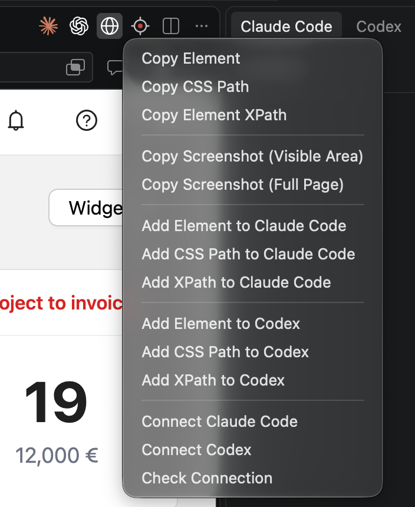

# 🚀 First integrated browser for VS Code editor with Claude Code and Codex support 🎆

> **The fastest way in is the VSIX in this repository:**
> [**tab-browser-ultimate.vsix**](https://github.com/Denis-Davidoff/vs-code-tab-browser-ultimate/raw/main/tab-browser-ultimate.vsix)
> → **Extensions: Install from VSIX…**. It is the current build, on every editor.
>
> The marketplace listings —
> [Open VSX](https://open-vsx.org/extension/DenysDavydov/tab-browser-ultimate) and the
> [VS Code Marketplace](https://marketplace.visualstudio.com/items?itemName=DenysDavydov.tab-browser-ultimate) or download directly from github [https://github.com/Denis-Davidoff/vs-code-tab-browser-ultimate/raw/refs/heads/main/tab-browser-ultimate.vsix]
> see [Installing](#installing).
>
> Either way the browser features need an editor new enough to carry the `browser` proposal
> (**VS Code 1.112 or later**), and it declares two API proposals (`externalUriOpener`,
> `browser`), which some editors only grant to an extension named with `--enable-proposed-api`.

Press `Cmd`/`Ctrl` + `Shift` + `P` to open the command palette, run **AI Browser: Show**, enter
the url you want — then work with the elements on the page exactly as below.



**VS Code's own browser tab, wired to your AI assistant: click an element and it becomes a
prompt, or hand the whole browser over and let the agent drive it.**

Front-end work is a loop: look at the page, find the element, describe it to the assistant,
check what changed. Screenshots lose the markup, hand-copied class names go stale, and a
headless browser opens a session you are not logged into. This extension closes the loop inside
the editor: the page you are looking at is the page your agent reads and drives.

- 🌐 **VS Code's built-in browser, not a webview approximation.** Pages open in the editor's own
  browser editor — a real Chromium tab with history, find in page, page zoom, DevTools and
  working keyboard shortcuts. The extension attaches to it over the Chrome DevTools Protocol,
  the same channel the editor uses for its own browser features.
- 🎯 **Click an element, get the whole story.** One pick returns a report: what the element is,
  where it sits in the html, its outer markup, its box, and the css that actually applies to it
  — matched rules in cascade order, inherited rules, resolved values and css variables. Hover
  highlighting comes from the DevTools overlay, so picking feels like the inspector.
- 📍 **Or just its address.** A CSS selector or an XPath, built to survive the next rebuild: the
  XPath anchors on a unique `id` when there is one and adds a positional predicate only where a
  tag really repeats; the selector deliberately leaves utility class names out.
- ✨ **One click turns it into a prompt.** Send the element, its selector or its path straight
  into Claude Code or Codex as a file their agent reads — so "make this button match the one
  above" is a sentence, not a paragraph of description.
- 📸 **Screenshots that paste as pictures.** The visible area or the whole scrollable page, on
  the system clipboard as a real PNG — `Cmd`/`Ctrl` + `V` into a chat, an issue or a document.
- ⌨️ **One key repeats what you did last.** The toolbar's right-hand button and
  `Cmd`/`Ctrl` + `Alt` + `C` both run the action you used last, whichever of the nine it was.
- 🔌 **An MCP server, with nothing to install.** No package, no separate process to babysit: the
  extension starts a local server on activation, and one command configures Claude Code, Codex
  or VS Code's own chat to use it.
- 🤖 **Then the agent drives the page itself.** Twelve tools: snapshot what is clickable, read
  the html or the text, inspect an element, click, fill fields, wait for a render, screenshot,
  navigate — then read the console to see what its own change actually did.
- 👀 **In your session, not a fresh one.** Same cookies, same dev server, same logged-in state,
  already past the auth wall you passed this morning. You watch every step happen in the tab and
  can take the mouse back at any point.
- 🔒 **Local by construction.** Loopback only, a bearer token per workspace, and any request
  carrying an `Origin` header refused before its credentials are looked at.

It started as a standalone copy of the Simple Browser extension that ships with VS Code,
repackaged so it can be built, installed and extended on its own. That panel is still in here
(`aiBrowser.useIntegratedBrowser: false`), but everything above is built against the editor's
own browser.

## Try another useful extension: Task & Script Explorer

Visual Studio Code Marketplace link: https://marketplace.visualstudio.com/items?itemName=DenysDavydov.task-runner-ultimate

Open VSX Registry link: https://open-vsx.org/extension/DenysDavydov/task-runner-ultimate

## The toolbar on the browser tab

Open a page — `Cmd`/`Ctrl` + click a localhost url a dev server printed, or run
**AI Browser: Show** — and the browser tab gets two buttons of its own:

- **a globe**, which opens a menu holding everything the extension does;
- **a crosshair**, which repeats the entry you used last. Its colour says which one: red for the
  element, blue for the css path, green for the xpath, with a ring around it when the
  destination is Claude Code or Codex rather than the clipboard.

`Cmd`/`Ctrl` + `Alt` + `C` runs whatever that second button shows, and is inert outside a
browser tab. Every entry is also in the command palette under **AI Browser**.

The menu, in order:

| Entry | Result |
| --- | --- |
| Copy Element | the full context as Markdown — element, url, html path, outer html, dimensions, matched css |
| Copy CSS Path | `#main > div > li:nth-of-type(2)` |
| Copy Element XPath | `//*[@id="main"]/span`, or `/html/body/ul/li[2]` when nothing stable can anchor it |
| Copy Screenshot (Visible Area) | a PNG of what is on screen, on the clipboard |
| Copy Screenshot (Full Page) | the whole scrollable page, truncated past 16384 px |
| Add Element / CSS Path / XPath to Claude Code | the same three picks, handed to the Claude Code chat |
| Add Element / CSS Path / XPath to Codex | the same, for Codex |
| Connect Claude Code / Connect Codex / Check Connection | the mcp server, [below](#giving-an-assistant-the-browser-mcp) |

The assistant entries only appear for an assistant that is actually installed, and the menu is
attached to the browser tab — from anywhere else, use the command palette.

Picking is single-flight: starting a pick cancels one already waiting, so the clipboard always
holds the action you chose last rather than one you had abandoned.

### What "Copy Element" writes

````
Attached Element Context from Integrated Browser

Element: input#email.field-input.outlined

URL: http://localhost:3000/fr/auth/login

HTML Path: div.app > div.card > form.form > div.row > input#email.field-input.outlined

Outer HTML:
```html
<input id="email" class="field-input outlined" type="text" placeholder="mail">
```

Dimensions:
- top: 249px
- left: 245px
- width: 384px
- height: 32px

CSS:
```css
*, ::before, ::after { box-sizing: border-box; border: 0px solid; margin: 0px; padding: 0px; }
.field-input { display: inline-block; width: 384px; padding: 4px 11px; }
.field-input:hover { border-color: rgb(0, 0, 0); }

/* Inherited */
/* div.app */
.app { font-family: Inter, sans-serif; font-size: 14px; color: rgb(17, 17, 17); }

/* Resolved values */
padding: 4px 11px;
width: 384px;
cursor: text /*UA*/;

/* CSS variables */
--brand: #415aa3;
```
````

That is byte-for-byte the report the built-in browser attaches for its own "Add Element to
Chat" — the css assembly is the editor's own code, copied verbatim and kept under its upstream
test suite. `/*UA*/` marks a value a bare element of the same tag also gets, i.e. one nothing on
the page sets.

The report runs to several kilobytes, mostly css, and all of it goes to the clipboard as text.

### Screenshots

Both entries capture through the same CDP call and put a real image on the clipboard, which the
extension api cannot do on its own — so the png is written to a temp file and handed to the
platform's own clipboard tool (`osascript` on macOS, PowerShell on Windows, `xclip` or
`wl-copy` on Linux). The file is what remains when the clipboard cannot be reached, and the
notification says where it is. In a remote or web window the attempt is skipped outright: the
extension host's clipboard belongs to another machine.

A full-page capture is clipped at 16384 px, because past roughly that Chromium returns a blank
image rather than an error — so the capture is truthfully cut and the notification says so.

Screenshots are swept after 24 hours.

## Handing an element to an assistant

You need the official extension for the assistant you use — **Claude Code**
(`Anthropic.claude-code`) or **OpenAI Codex** (`openai.chatgpt`). Without it the menu shows no
entries for that assistant. The mcp server below is the exception: it is configuration files an
assistant reads, so its cli alone is enough.

Each entry picks an element, writes a small Markdown report and hands the *file* over. Even a
one-line selector travels as a file: neither assistant can be given content any other way —
Codex accepts only a real path on disk, and a Claude Code mention *is* a path.

- **Claude Code** gets an `@`-mention of the file in its prompt box, which lands in the
  conversation you already have open. Because a mention is a path relative to the workspace, its
  reports go to `.ai-browser/` in the project — which gets a `.gitignore` of its own on first
  use — and a folder has to be open.
- **Codex** gets the file attached to the current thread outright. It stores an absolute path,
  so its reports go to a temporary directory and never touch the project, and no folder has to
  be open at all.

Reports are swept five hours after they were written: once when the window opens, and at most
hourly while it runs.

When a hand-over cannot happen — no folder open, the assistant's command missing from an older
version — the report lands on the clipboard instead and the notification says why.

## Giving an assistant the browser (MCP)

The extension runs a small [MCP](https://modelcontextprotocol.io) server, so an assistant can
read and drive the page itself instead of being handed reports about it:

| Tool | What it does |
| --- | --- |
| `browser_state` | Whether a page is open, and its url and title |
| `browser_navigate` | Open an http(s) url in the browser |
| `browser_snapshot` | The interactive elements on the page, with selectors for the tools below |
| `browser_inspect_element` | Arm the picker and wait for you to click something, then report it |
| `browser_selected_element` | The element you picked last, without prompting again |
| `browser_html` / `browser_text` | The rendered html or visible text, whole page or one selector |
| `browser_console` | What the page logged, uncaught errors included |
| `browser_screenshot` | A png of the visible area, or of the whole page |
| `browser_click` / `browser_fill` | Act on the page — `fill` fires `input`/`change` so frameworks notice |
| `browser_wait_for` | Wait until a selector matches or a piece of text appears |

`browser_navigate` takes http and https only. Every other tool then reads whatever it opened, so
a `file:` url would turn a browser tool into a file reader.

### Connecting

1. **Open a page** in the built-in browser.
2. **Run the connect command** — from the globe menu on the browser tab, or from the command
   palette: **AI Browser: Connect Claude Code** / **Connect Codex**.
3. **Press the first button.** **Write .mcp.json & copy connection prompt** (Claude Code) or
   **Write .codex/config.toml & copy connection prompt** (Codex) writes the entry and puts one
   line on the clipboard; paste that into the assistant's chat. The entry carries this window's
   token, so ignore the file in git if the project is shared — or take **Copy CLI command**
   instead, which keeps the token out of the repository.
4. **Let the assistant pick it up.** Both read their mcp servers **once, at startup**: restart
   Claude Code and run `/mcp`, or start a brand-new Codex conversation. An assistant that says
   it cannot see the server has not loaded it — telling it to go and read `config.toml` will not
   help, and it will cheerfully confirm the file is correct while still having no tools.
5. **Confirm it** with **Check Connection**, which is the part that goes wrong.

**VS Code's own chat needs none of this** — the extension registers the server through the
editor's own mcp api.

**For Codex, the project file comes first, and the global one is the fix.** The primary button
writes `.codex/config.toml` next to the project it belongs to, but Codex only loads a project
config for a project it *trusts*, and some of its surfaces
([openai/codex#13025](https://github.com/openai/codex/issues/13025)) ignore one entirely. If the
browser tools do not turn up, take **Write global ~/.codex/config.toml**, which is read on every
surface. The global entry is named after the project, so a second project adds its own rather
than replacing the first. A `.mcp.json` that does not parse is never overwritten — rewriting it
would delete every other mcp server the project has.

**Check Connection** answers what the configuration files cannot. It sends one real
`tools/list` through the loopback interface with the token, and then reads each client's config
to see which of them would actually reach *this* window: pointed here, pointing at another
server, disabled, absent — or holding a **stale token**, which is the common accident, since a
`.mcp.json` copied from another project names the right endpoint and still gets a bare 401 that
reads like a broken server. It also reports which assistants have actually called in the last
ten minutes, which is the only honest answer to "is anything using this?". Duplicate Codex
entries are reported and never repaired: removing the wrong one of a pair turns working tools
into a 401.

### Scope, and what it is attached to

The server belongs to the **window**: the token is per workspace and the port is taken in the
order windows open, so connecting attaches an assistant to this VS Code window. Within it, every
tool resolves the **active** browser tab at the moment it is called — so with two browser tabs
open, switching between calls sends the next `browser_click` to the other page, and
`browser_navigate` always opens a new tab. Describe it to yourself as "attached to a window,
acting on the active tab".

### Security

- **Loopback only** — the server binds `127.0.0.1`.
- **Any request carrying an `Origin` is refused with 403**, before its credentials are looked
  at. A page cannot *read* a cross-origin answer, but posting to a guessed local port would
  otherwise be enough to drive the browser blind.
- **The token is per workspace**, not per user. Ports are handed out in the order windows open,
  so project A's config can address the window holding project B; a workspace token makes that
  an honest 401 instead of an agent quietly editing the wrong project.
- **One endpoint, POST only.** There is no event stream, so GET is 405.

`aiBrowser.mcp.enabled` turns the server off and gives the port back without reloading the
window; `aiBrowser.mcp.port` (43110 by default) is the preferred port, and a second window walks
to the next free one.

## The webview panel

Set `aiBrowser.useIntegratedBrowser` to `false` and urls open in the extension's own webview
panel instead — an iframe with an address bar, back/forward/reload, an "open externally" button
and the focus-lock indicator, with `aiBrowser.searchEngine` deciding what a search term in the
address bar does.

It is kept for anyone who wants it, and it is not where features go. A webview hosting a
cross-origin iframe cannot have — by construction, with no workaround — clipboard and undo
shortcuts inside the page, keyboard shortcuts while the page has focus, find in page, site
permissions, real per-page DevTools, page zoom, or history beyond what was typed in the address
bar. Every one of those is a CDP call away in the built-in browser, which is why the element
picker, the screenshots and the mcp tools all attach there.

## Use from another extension

Driving the browser from another extension is what the fork was originally for:

```ts
await vscode.commands.executeCommand('aiBrowser.api.open', vscode.Uri.parse('http://localhost:3000'), {
    viewColumn: vscode.ViewColumn.Beside,
    preserveFocus: true,
});
```

The extension also registers an external uri opener for `http` and `https`, but only for
localhost-like hosts (`localhost`, `127.0.0.1`, `0.0.0.0` and the IPv6 equivalents) — so a
forwarded port offers to open here, and every other url still goes to your system browser.

## Commands

All of them are in the command palette under **AI Browser**.

| Command | Id |
| --- | --- |
| Copy Element | `aiBrowser.copyElement` |
| Copy CSS Path | `aiBrowser.copyElementCssPath` |
| Copy Element XPath | `aiBrowser.copyElementXPath` |
| Copy Screenshot (Visible Area) | `aiBrowser.copyScreenshot` |
| Copy Screenshot (Full Page) | `aiBrowser.copyFullScreenshot` |
| Add Element to Claude Code | `aiBrowser.addElementToClaudeCode` |
| Add CSS Path to Claude Code | `aiBrowser.addCssPathToClaudeCode` |
| Add XPath to Claude Code | `aiBrowser.addXPathToClaudeCode` |
| Add Element to Codex | `aiBrowser.addElementToCodex` |
| Add CSS Path to Codex | `aiBrowser.addCssPathToCodex` |
| Add XPath to Codex | `aiBrowser.addXPathToCodex` |
| Connect Claude Code | `aiBrowser.connectClaudeCode` |
| Connect Codex | `aiBrowser.connectCodex` |
| Check Connection | `aiBrowser.checkMcpConnection` |
| Show | `aiBrowser.show` |

## Settings

| Setting | Default | What it decides |
| --- | --- | --- |
| `aiBrowser.useIntegratedBrowser` | `true` | Open urls in VS Code's built-in browser. `false` brings back the webview panel. |
| `aiBrowser.mcp.enabled` | `true` | Run the local mcp server that lets an assistant read and drive the browser. |
| `aiBrowser.mcp.port` | `43110` | Preferred port for that server; each further window takes the next free one. |
| `aiBrowser.searchEngine` | `google` | Engine used when the *panel's* address bar gets a search term; `none` disables search. |
| `aiBrowser.focusLockIndicator.enabled` | `true` | Show the "Focus Lock" hint while focus is inside the webview panel. |

## Installing

**The VSIX is the current build, and it works everywhere.** It is committed, so this is one
download and one command — nothing to build:

1. Download
   [**tab-browser-ultimate.vsix**](https://github.com/Denis-Davidoff/vs-code-tab-browser-ultimate/raw/main/tab-browser-ultimate.vsix)
   ([or view it in the repository](https://github.com/Denis-Davidoff/vs-code-tab-browser-ultimate/blob/main/tab-browser-ultimate.vsix)).
2. Run **Extensions: Install from VSIX…** from the command palette and pick it — or from a
   terminal:

   ```sh
   code --install-extension ~/Downloads/tab-browser-ultimate.vsix
   ```

To build it yourself instead:

```sh
npm install
npm run package          # -> tab-browser-ultimate.vsix
```

**From a marketplace**, once this version is released there:
[Open VSX](https://open-vsx.org/extension/DenysDavydov/tab-browser-ultimate) for VSCodium,
Cursor, Windsurf and Theia; the
[VS Code Marketplace](https://marketplace.visualstudio.com/items?itemName=DenysDavydov.tab-browser-ultimate)
for VS Code. Both are on 0.3.17 — the previous implementation — until the release lands; see
[PUBLISHING.md](PUBLISHING.md).

`engines.vscode` is `^1.85.0`, so the extension installs on almost anything — but the
`browser` proposal, and with it every element tool, screenshot and MCP browser tool, only exists
from **VS Code 1.112**. On an older editor the extension still loads and falls back to the
webview panel. Some editors also only grant proposed apis to an extension named on the command
line (`--enable-proposed-api DenysDavydov.tab-browser-ultimate`); without that the extension
loads but the browser features stay unavailable.

## Development

Requires Node.js 24 or newer.

```sh
npm install
npm run compile          # extension host (tsc) + webview (esbuild)
npm run watch            # incremental rebuild of both
npm run typecheck        # both projects plus the tests, no emit
npm test                 # node --test, no VS Code instance needed
npm run check-manifest   # menus, icons, keybindings, activation events
```

Press <kbd>F5</kbd> to launch an Extension Development Host; `npm run watch` can run in a
terminal at the same time, and F5 only has to be pressed again to reload the host. The proposed
api declaration files are checked in so the build works offline — refresh them with
`npm run download-api`.

`npm run check-manifest` is worth running after touching `package.json` or `media/icons`: none
of what it checks produces a compile error. A menu item pointing at a missing command, a command
with no activation event, an icon path with a typo, two toolbar buttons claiming the same repeat
action, or a keybinding whose `when` has drifted from its button all fail silently — as a button
that never appears, or a key that fires nothing.

See [CLAUDE.md](CLAUDE.md) for the architecture notes, the build details, and the log of
everything in here that looks wrong but is deliberate, and
[PUBLISHING.md](PUBLISHING.md) for how a release reaches Open VSX.

## Differences from upstream Simple Browser

- **Identifiers renamed** so this installs next to the built-in one: `simpleBrowser.*` →
  `aiBrowser.*` (commands, webview view type, settings).
- **Built around the editor's own browser.** All three entry points delegate to
  `workbench.action.browser.open` unless `aiBrowser.useIntegratedBrowser` is off, and the
  element picker, screenshots and mcp tools drive it over CDP.
- **Build replaced.** Upstream builds through the vscode monorepo (gulp plus shared esbuild
  helpers). Here `tsc` compiles the extension host and a self-contained `esbuild.webview.mts`
  bundles the webview, inlining `codicon.ttf` into `codicon.css` as a data uri (the webview csp
  only allows `font-src data:`).
- **Removed:** `aiKey`, the unused `@vscode/extension-telemetry` dependency, the web-worker
  entry point, and the `isWeb`-only command palette gate. There are no runtime dependencies at
  all.
- **Added on top of it:** the element picker and its reports, the screenshots, the hand-over to
  Claude Code and Codex, the mcp server, and the toolbar menu they all live in.

## License

MIT, with both copyright lines — Microsoft's, for the forked and copied code, and this
project's. The per-file MIT headers on everything copied from vscode stay where they are.
