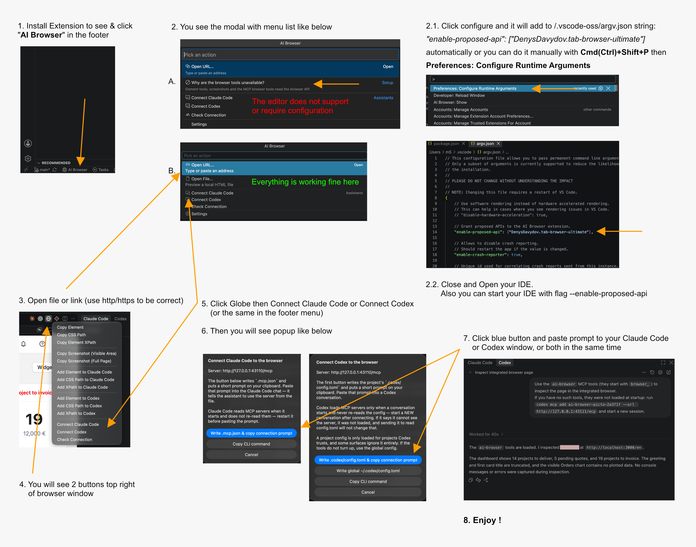

# 🚀 First integrated browser for VS Code editor with Claude Code and Codex support 🎆

## Which editors this works on

The browser features are built on VS Code's own browser tab, reached through the `browser` API
proposal. An editor that does not ship that proposal cannot run them — installing the extension
there is not the problem, the missing API is. **Measured by reading the shipped builds on
2026-09-09**, ordered by how much work each one takes:

| Editor | Version tested | Browser features | How to install | Then |
|---|---|---|---|---|
| **VSCodium** | 1.135 | ✅ yes | Open VSX, one click | Enable Browser API, quit and reopen |
| **Devin** (Windsurf) | 1.126 | ✅ yes | Open VSX, one click | Enable Browser API, quit and reopen |
| **VS Code** | 1.137 | ✅ yes | **the `.vsix` by hand** | Enable Browser API, quit and reopen |
| **Cursor** | 3.19.19 | ❌ no | — | nothing helps — the API is absent |
| **Antigravity IDE** | 1.107 | ❌ no | — | nothing helps — base predates the API |
| **Kiro** | 1.0.437 | ❌ no | — | nothing helps — has the browser, not the API |
| **Trae** | 1.107.1 | ❌ no | — | nothing helps — base predates the API |
| **Theia IDE** | 1.75 | ❌ no | — | nothing helps — not a VS Code build |

**Setup at a glance** — the whole path in eight numbered steps; click the picture for full size:

[](https://raw.githubusercontent.com/Denis-Davidoff/vs-code-tab-browser-ultimate/main/ai-browser-instruct.jpg)

**Not sure about your editor?** Run **AI Browser: Enable Integrated Browser API**, or pick it
under *Setup* in the status bar menu, and it says which of the three answers applies. The rule is
a VS Code 1.112 or newer base with the `browser` proposal left in — a fork's own version number
tells you nothing (Cursor reports 1.128 and still lacks it).

> **The fastest way in is the VSIX in this repository:**
> [**tab-browser-ultimate.vsix**](https://github.com/Denis-Davidoff/vs-code-tab-browser-ultimate/raw/main/tab-browser-ultimate.vsix)
> → **Extensions: Install from VSIX…**. It is the current build.
>
> [**Open VSX**](https://open-vsx.org/extension/DenysDavydov/tab-browser-ultimate) carries the
> same build, and is the one-click route on VSCodium, Devin, Cursor, Windsurf and Theia —
> installing is not the same as the browser features working, see the table above. The
> [**VS Code Marketplace**](https://marketplace.visualstudio.com/items?itemName=DenysDavydov.tab-browser-ultimate-promo)
> entry is the guide and the download link, not the extension itself — the Marketplace does not
> accept an extension that declares API proposals. See [Installing](#installing) below.
>
> On a supported editor there is **one step after installing**: the extension declares two API
> proposals (`externalUriOpener`, `browser`) and an editor only grants those to an extension
> named with `--enable-proposed-api`. Click the orange **Enable Browser API** button in the
> status bar and it writes that for you — see
> [Enabling the browser API](CLAUDE.md#enabling-the-grant-in-one-click).

Press `Cmd`/`Ctrl` + `Shift` + `P` to open the command palette, run **AI Browser: Show**, enter
the url you want — then work with the elements on the page exactly as below.

**VS Code's own browser tab, wired to your AI assistant: click an element and it becomes a
prompt, or hand the whole browser over and let the agent drive it.**

Front-end work is a loop: look at the page, find the element, describe it to the assistant,
check what changed. Screenshots lose the markup, hand-copied class names go stale, and a
headless browser opens a session you are not logged into. This extension closes the loop inside
the editor: the page you are looking at is the page your agent reads and drives.

- 🌐 **VS Code's built-in browser, not a webview approximation.** Pages open in the editor's own
  browser editor — a real Chromium tab with history, find in page, page zoom, DevTools and
  working keyboard shortcuts. The extension attaches to it over the Chrome DevTools Protocol,
  the same channel the editor uses for its own browser features.
- 🎯 **Click an element, get the whole story.** One pick returns a report: what the element is,
  where it sits in the html, its outer markup, its box, and the css that actually applies to it
  — matched rules in cascade order, inherited rules, resolved values and css variables. Hover
  highlighting comes from the DevTools overlay, so picking feels like the inspector.
- 📍 **Or just its address.** A CSS selector or an XPath, built to survive the next rebuild:
  both anchor on a unique `id` when there is one and add a positional predicate only where a
  tag really repeats; the selector deliberately leaves utility class names out. **Copy CSS
  Path + Location** puts the page in front of it — `http://localhost:3000/checkout → #main >
  li:nth-of-type(2)` — so an assistant reading it knows which route the selector belongs to
  instead of guessing, in the order it will use them: navigate, then find. It arrives on the
  clipboard already wrapped as inline code, ready to paste into a chat message.
- ✨ **One click turns it into a prompt.** Send the element, its selector or its path straight
  into Claude Code or Codex as a file their agent reads — so "make this button match the one
  above" is a sentence, not a paragraph of description.
- 📸 **Screenshots that paste as pictures.** The visible area or the whole scrollable page, on
  the system clipboard as a real PNG — `Cmd`/`Ctrl` + `V` into a chat, an issue or a document.
- ⌨️ **One key repeats what you did last.** The toolbar's right-hand button and
  `Cmd`/`Ctrl` + `Alt` + `C` both run the action you used last, whichever of the twelve it was.
- 🔌 **An MCP server, with nothing to install.** No package, no separate process to babysit: the
  extension starts a local server on activation, and one command configures Claude Code, Codex
  or VS Code's own chat to use it.
- 🤖 **Then the agent drives the page itself.** Fourteen tools: snapshot what is clickable, read
  the html or the text, inspect an element, click, fill fields, wait for a render, screenshot,
  navigate — then read the console to see what its own change actually did.
- 👀 **In your session, not a fresh one.** Same cookies, same dev server, same logged-in state,
  already past the auth wall you passed this morning. You watch every step happen in the tab and
  can take the mouse back at any point.
- 🔒 **Local by construction.** Loopback only, a bearer token per workspace, and any request
  carrying an `Origin` header refused before its credentials are looked at.

It started as a standalone copy of the Simple Browser extension that ships with VS Code,
repackaged so it can be built, installed and extended on its own. That panel is still in here
(`aiBrowser.useIntegratedBrowser: false`), but everything above is built against the editor's
own browser.

## Try another useful extension: Task & Script Explorer

Visual Studio Code Marketplace link: https://marketplace.visualstudio.com/items?itemName=DenysDavydov.task-runner-ultimate

Open VSX Registry link: https://open-vsx.org/extension/DenysDavydov/task-runner-ultimate

## The toolbar on the browser tab

Open a page — `Cmd`/`Ctrl` + click a localhost url a dev server printed, or run
**AI Browser: Show** — and the browser tab gets two buttons of its own:

- **a globe**, which opens a menu holding everything the extension does;
- **a crosshair**, which repeats the entry you used last. Its colour says which one: red for the
  element, blue for the css path, purple for the css path + location, green for the xpath, with a
  ring around it when the destination is Claude Code or Codex rather than the clipboard.

`Cmd`/`Ctrl` + `Alt` + `C` runs whatever that second button shows, and is inert outside a
browser tab. Every entry is also in the command palette under **AI Browser**.

The menu, in order:

| Entry | Result |
| --- | --- |
| Copy Element | the full context as Markdown — element, url, html path, outer html, dimensions, matched css |
| Copy CSS Path | `#main > div > li:nth-of-type(2)` |
| Copy CSS Path + Location | the page and the selector on one line, wrapped as inline code: `http://localhost:3000/a/b → #main > div > li:nth-of-type(2)` |
| Copy Element XPath | `//*[@id="main"]/span`, or `/html/body/ul/li[2]` when nothing stable can anchor it |
| Copy Screenshot (Visible Area) | a PNG of what is on screen, on the clipboard |
| Copy Screenshot (Full Page) | the whole scrollable page, truncated past 16384 px |
| Claude Code ▸ | a submenu: the same four picks handed to the Claude Code chat, plus Connect and Share Tab |
| Codex ▸ | the same, for Codex |
| Check Connection | the mcp server, [CLAUDE.md](CLAUDE.md#mcp-the-browser-exposed-to-claude-code-codex-and-vs-code-chat) |
| Share Tab with All Assistants / Stop Sharing Tab | [CLAUDE.md](CLAUDE.md#mcp-the-browser-exposed-to-claude-code-codex-and-vs-code-chat) |

Everything belonging to one assistant lives in that assistant's submenu, which is what keeps the
top level at eleven rows. The four **Add** entries there appear only for an assistant whose
extension is actually installed; **Connect** and **Share Tab** are always there, because an
assistant driven from a terminal through `.mcp.json` needs them and has no extension to detect.
The menu is attached to the browser tab — from anywhere else, use the command palette.

Picking is single-flight: starting a pick cancels one already waiting, so the clipboard always
holds the action you chose last rather than one you had abandoned.

---

Everything below this point — what each command writes, the mcp server and its tools, sharing a
tab, the settings and command reference, installing, the `argv.json` grant, and the build — is
in **[CLAUDE.md](CLAUDE.md)**, which is the project's working reference and is kept current with
the code.

## Use from another extension

Driving the browser from another extension is what the fork was originally for:

```ts
await vscode.commands.executeCommand('aiBrowser.api.open', vscode.Uri.parse('http://localhost:3000'), {
    viewColumn: vscode.ViewColumn.Beside,
    preserveFocus: true,
});
```

The extension also registers an external uri opener for `http` and `https`, but only for
localhost-like hosts (`localhost`, `127.0.0.1`, `0.0.0.0` and the IPv6 equivalents) — so a
forwarded port offers to open here, and every other url still goes to your system browser.

## Installing

It is not on the VS Code Marketplace: the Marketplace does not accept an extension that declares
API proposals. Install [`tab-browser-ultimate.vsix`](tab-browser-ultimate.vsix) from this
repository with **Extensions: Install from VSIX…**, then run **AI Browser: Enable Integrated
Browser API** and quit the editor completely. [CLAUDE.md](CLAUDE.md) has the detail, including
which editors can work at all.

## License

MIT, with both copyright lines — Microsoft's, for the forked and copied code, and this
project's. The per-file MIT headers on everything copied from vscode stay where they are.
